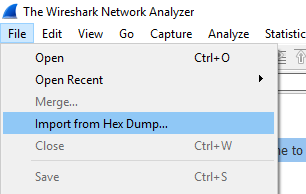

# SEPparser Summary:
SEPparser was created because I could not find anything to parse Symantec's Endpoint Protection data into a human readable form. I was fairly successful with MS Logparser but it couldn't parse all the logs correctly. It did not make sense to me to have to go into SEPMC to query logs when they were right on the endpoint. This data contains a wealth of untapped information that can be used during an investigation.

SEPparser is a command line tool for parsing Symantec Endpoint Protection data. You can either feed it a single file or an entire directory. This even works remotely. SEPparser will figure out what file it is and parse it correctly.

# Capabilities
* Parse settings for log files
* Parse the following log files:  
  * Security log  
  * System log
  * Firewall Traffic log
  * Firewall Packet log
  * Application and Device Control log
  * AV Management plugin log
  * Daily AV logs
* Extract packets from Firewall Packet log
* Parse ccSubSDK data into csv reports
* Extract potential binary blobs from ccSubSDK
* Parse VBN files into csv reports
* Extract quarantine data to file or hex dump
* Preform hex dump of VBN for research

# Usage:
  

To use SEPparser, simply provide a directory or file and SEPparser will take care of the rest.
> c:\temp\SEPparser.exe -d "C:\ProgramData\Symantec\Symantec Endpoint Protection\CurrentVersion\Data\Logs"  

Once SEPparser runs, a series for files and directories will be created in the location SEPparser was ran from. You can designate a different folder by using the -o option.  

  

In addition to the log files, a packet.txt file is created. This file is a hex dump of all packets from the packet log and can be viewed with Wireshark.
In Wireshark go to File > Import from Hex Dump...

   

Select the paclet.txt file and click Import  

  

You can now view the packets and save them in a pcap if you choose.  

 